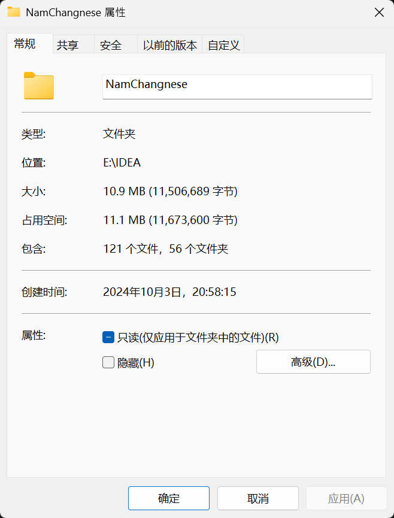

# 豫章词 —— 方言词典和学习软件

## 介绍

### 目的：尝试使用编程能力实现一个完整的方言词典

### 相关项目

<a href="https://github.com/Yau-ShuoWen/Lexicon-of-Yuzhang" target="_blank">后端服务器正在开发（进入）</a>

<a href="https://github.com/Yau-ShuoWen/Lexicon-of-Yuzhang-Android">安卓应用程序正在开发（进入）</a>

## 历程

## 代码相关

### 代码目录

### 提交记录符号说明

- 1️⃣ 排列：关于一次提交不同模块之间的大标题符号
- 📖 新学：如果用到了新学习的系统的知识完成，**学习小的用法不算**
- 📤 新增：新增了一个**完整的**功能或者类
- ✏️ 修改：对于不完整的类新增一部分代码，**补充业务流程**
- 🪛 重构：对于已经提交的代码换一种新的方式实现，**修改业务流程，不大改结果**
- 🗑️ 删除：对于过时的功能的删除，**不会保留备份**，如果需要请检查历史提交记录
- 🐛 揥蚆蛒：戏称debug，修改了一个**已经提交的**代码但是出问题的点
- 🚀 重大更新：一般不会出现，如果因为**客观原因**长期写了代码没提交（数据库崩溃、无法测试等），整理的时候会标注
- 🗃️ 杂项更新：一些小功能的更新，或者补充一些被漏的提交
- 📁 文档：撰写文档提交
- 🌱 经验：**不会出现在标题上**，在编码过程中比较重要的经验
- 🎉 新版本：一般不会出现，因为网页一般不会分发
- 🧪 测试功能新版本：一般不会出现，因为网页一般不会分发